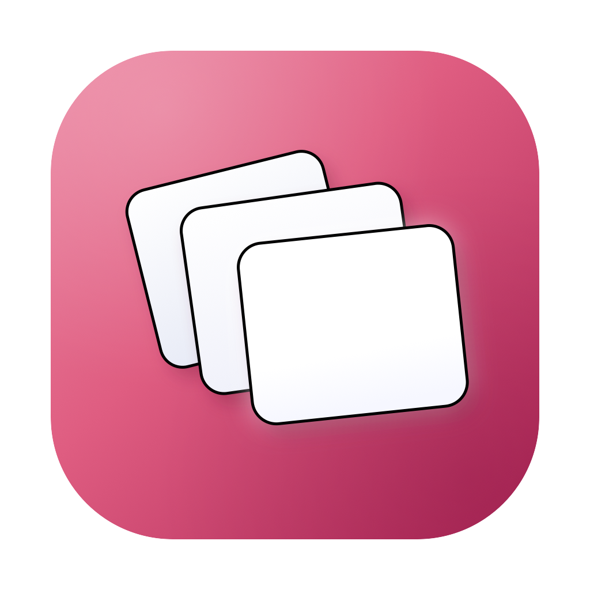
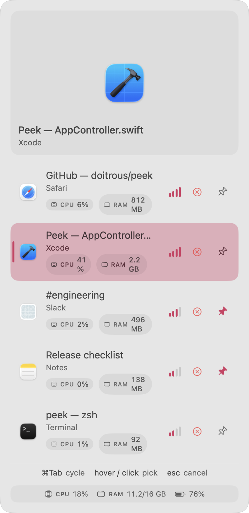
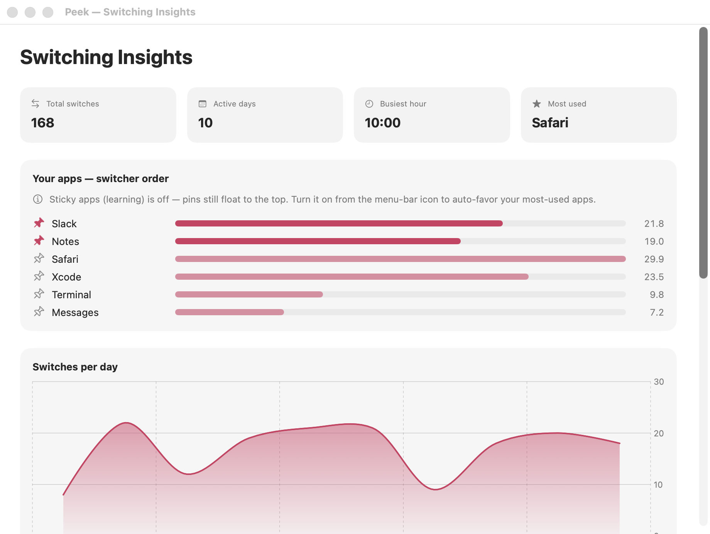
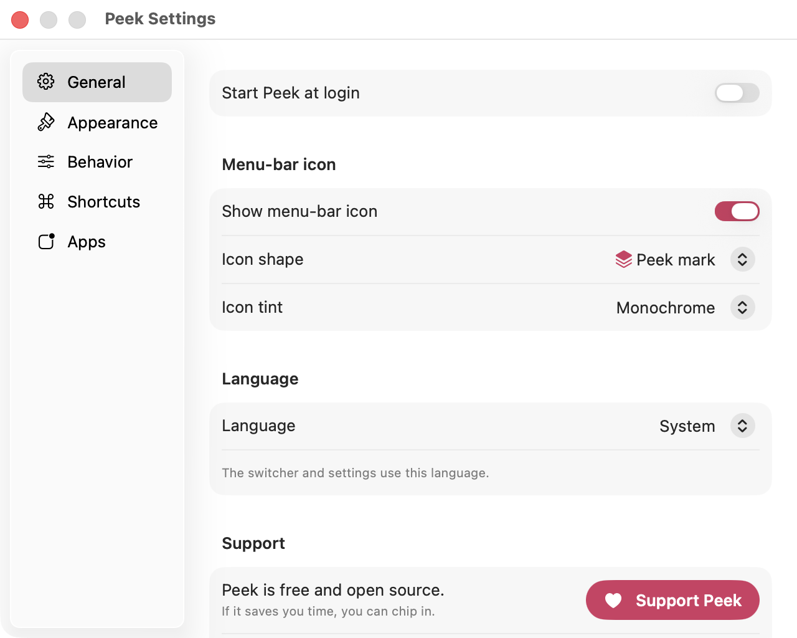

<div align="center">



# Peek

**A native macOS window switcher that replaces `⌘-Tab` — and learns which apps you actually use.**

Peek takes over the system `⌘-Tab` switcher with a left-side column of **live window
previews**, per-app **CPU/RAM**, one-keystroke **quit** and **pin**, a built-in
**dashboard of your switching habits**, and an order that gets smarter the more you use it.



</div>

## Overrides the macOS switcher — same keys

Peek intercepts `⌘-Tab` at the system level (a `CGEventTap`), so you keep the exact
muscle memory you already have — **hold `⌘`, tap `Tab`** — but get Peek's column
instead of Apple's. The native switcher never appears. Prefer a different trigger?
Switch it to `⌥-Tab` or `⌃-Tab` in Settings.

## Smart ordering — the whole point

Most switchers show windows in a fixed order. Peek ranks them by how you actually work,
using two independent layers:

### 🧠 Sticky apps (opt-in learning, off by default)
A lightweight learning layer scores every app by **recency-weighted switch frequency**
(a 7-day half-life), so the more you switch to an app, the higher Peek floats it —
**automatically**. Your busiest apps drift to the top and are always the first keystroke
away, while apps you've cooled on quietly sink. Each row shows an **affinity meter**
(signal bars) so you can *see* what Peek has learned. A first-run window explains it with a
live demo; enable it there or anytime from the menu-bar icon. Until you do, Peek behaves
like a classic `⌘-Tab`. The window you're leaving always stays at index 0, so a quick
`⌘-Tab`-release is still "flip to the last app."

### 📌 Pinning (always on)
Pin the apps you always want first with the 📌 button on any row (or from the dashboard).
Pinned apps float to the top of the switcher **independently** of the learning layer —
always there, whether or not sticky apps is on.

Together: pins give you a fixed home row; sticky apps orders everything else by real usage.

<div align="center">

</div>

## 📊 Switching Insights

A built-in dashboard (SwiftUI + Swift Charts) turns your switching history into a picture
of **how your workflow actually works** — total switches, active days, busiest hour, most-used
app, switches per day, top apps, hourly rhythm, and your most common app-to-app transitions.
The **"Your apps"** panel shows the exact order that drives the switcher, with inline pinning.

It's also the foundation for what's next: because Peek already understands your transitions
and rhythms, it can grow **customizable, per-user workflows** — surfacing the right set of
apps for the task you're in, at the time of day you usually do it. The data is already there;
the automation is the roadmap.

## Everything else

- **Live previews, RAM-lite** — only the *selected* window's thumbnail is ever captured, one
  at a time, via **ScreenCaptureKit**.
- **Per-app CPU / RAM** — each row shows the app's live CPU% and memory, sampled only for the
  visible windows, only while the switcher is open (a cheap per-pid `proc_pid_rusage` call —
  no global scan, no background polling).
- **Live system footer** — CPU, memory, and battery at the bottom of the column.
- **Quit from the switcher** — `Q`/`W` or the ✕ button quits the highlighted app; hold `⌥`
  to force quit. The row disappears immediately.
- **Keyboard-first** — while holding the modifier: `Tab`/`⇧Tab` cycle, `↑↓` navigate,
  **`1`–`9` jump** straight to a window, `Home`/`End` go to first/last, `P` pins.
- **Settings** — theme, light/dark, animations, switcher position (left/center), max rows,
  which display & Spaces, menu-bar icon shape & tint, hidden apps, and every shortcut toggle.
- **5 languages** — English, Español, 中文, العربية (RTL), Français.
- **Auto-update** — ships with [Sparkle](https://sparkle-project.org); **Check for Updates…**
  is in the menu.

<div align="center">

</div>

## Install

```bash
bash setup-signing.sh   # once: stable self-signed identity (permission grants then persist)
bash make-app.sh        # builds + installs /Applications/Peek.app
open /Applications/Peek.app
```

Peek lives in the menu bar. First launch prompts for two permissions:

1. **Accessibility** — to intercept `⌘-Tab` and raise windows.
2. **Screen Recording** — to read window titles and capture thumbnails.

Grant both in **System Settings → Privacy & Security**, then relaunch. (A stable signature
keeps the grants across rebuilds.)

> Distributing to others? See [`RELEASE.md`](RELEASE.md) for the Developer ID signing +
> notarization + appcast flow.

## Shortcuts

Hold the activation modifier (`⌘` by default) and:

| Keys | Action |
|------|--------|
| `Tab` / `⇧Tab` | next / previous window |
| `↑ ↓` (or `← →`) | navigate the selection |
| `1`–`9` | jump straight to that window |
| `Home` / `End` | first / last window |
| `P` | pin / unpin the highlighted app |
| `Q` / `W` | quit the highlighted app (`⌥` = force) |
| release the modifier | switch to the highlighted window |
| `Esc` | cancel |
| hover / click a row | highlight / switch with the mouse |
| menu bar → **Switching Insights…** | open the dashboard |

Every extra key can be toggled off in **Settings → Shortcuts**.

## Project layout

- `Sources/PeekCore/` — pure, tested logic: `SwitchEvent`, `StatsStore` / `PinStore` (JSON
  persistence), `StatsAggregator` (per-day / top-apps / hourly / transitions), `WindowRanker`
  (affinity scoring + pin-aware ordering).
- `Sources/Peek/` — the app: `HotKey` (`CGEventTap`), `WindowLister` (`CGWindowList` +
  ScreenCaptureKit thumbnails), `SwitcherPanel` (SwiftUI overlay), `WindowActivator`
  (exact-window raise via AX + `_AXUIElementGetWindow`), `Dashboard` (Swift Charts),
  `SettingsWindow`, `Localize`.
- `Tests/PeekCoreTests/` — `swift test` covers ranking, aggregation, and persistence.
- CI builds + tests every PR (`.github/workflows/ci.yml`).

## Requirements

macOS 14+ · Swift 6 toolchain · Apple Silicon or Intel. Built with Swift Package Manager
(no Xcode project needed).

## License

See [`LICENSE`](LICENSE). Issues and PRs welcome — Peek is open source.
